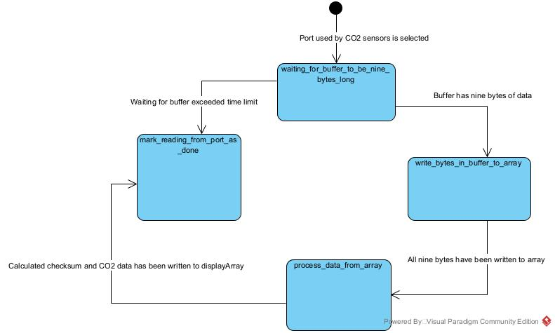
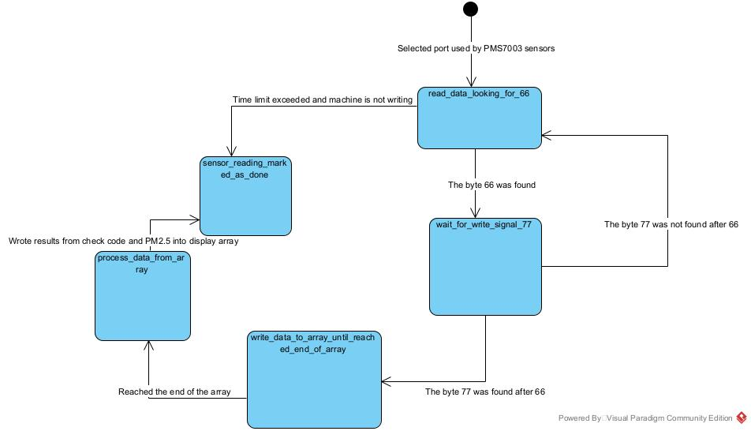
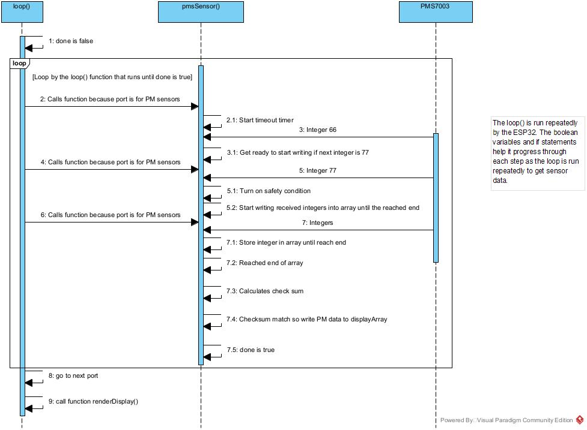
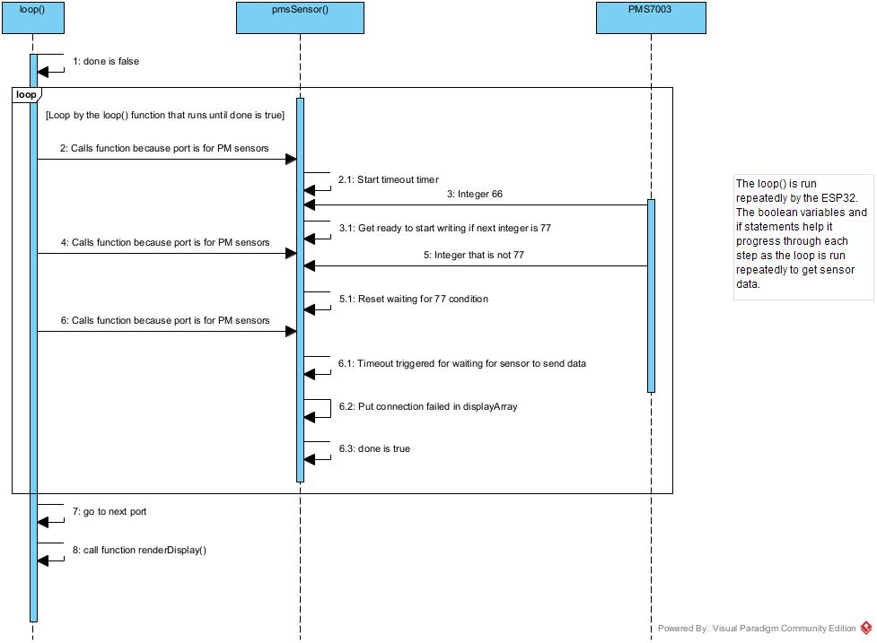
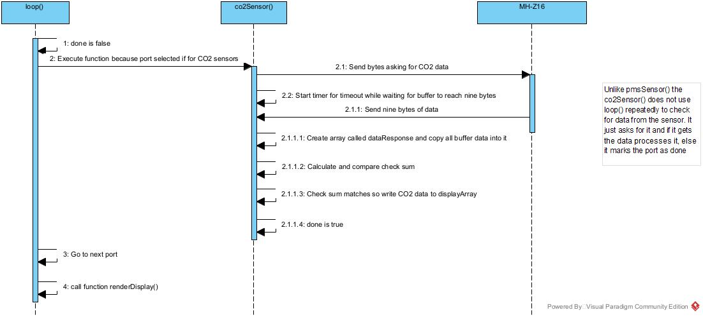

# 2025 Summer Internship at interlab code
The files bt_spp_acceptor and turnLedOnFromPhone are files made from me reinstalling ESP-IDF to make sure it works correctly. The files screenDisplay, and pmsArrayWorks are code I wrote first to learn how to read from a sensor and print to the LCD screen before moving on to multiplexorPrintCheck which contains that actual code to check all the sensors connected to a multiplexor and print the results obtained from the sensors connected to the multiplexor.

## Sensor Testing Documentation
The following are diagrams to help understand how the multiplexorPrintCheck program works.

MH-Z16 CO2 sensor state diagram:

PMS7003 sensor state diagram:

Getting PM data sequence diagrams:

Getting CO2 data sequence diagrams:

### How it works:
The pmsSensor() is repeatedly called by the loop() to read the PM sensors. It progresses through each step of reading the sensor by using boolean variables and if statements to guide it. On the other hand, the co2Sensor() is not repeatedly called. It is called only once and returns with connection failed or the actual data. The program goes to a port, gets data, prints it, then moves to the next port. Depending on the port how it gets sensor data is different because those ports are intended for specific types of sensors and so which port it selects affects its approach becase the two sensors work differently.