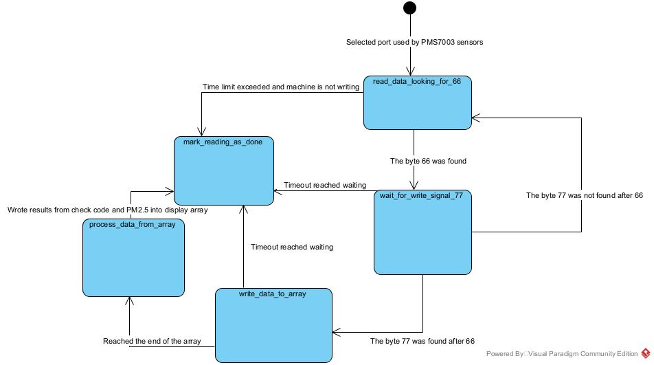
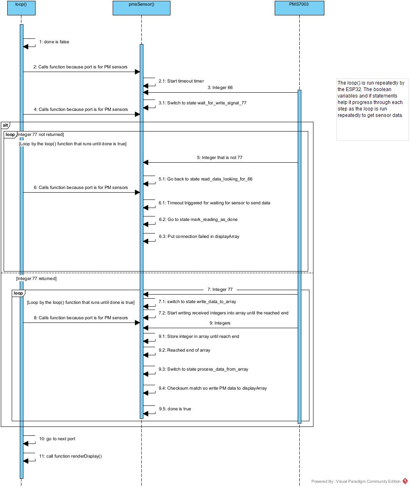
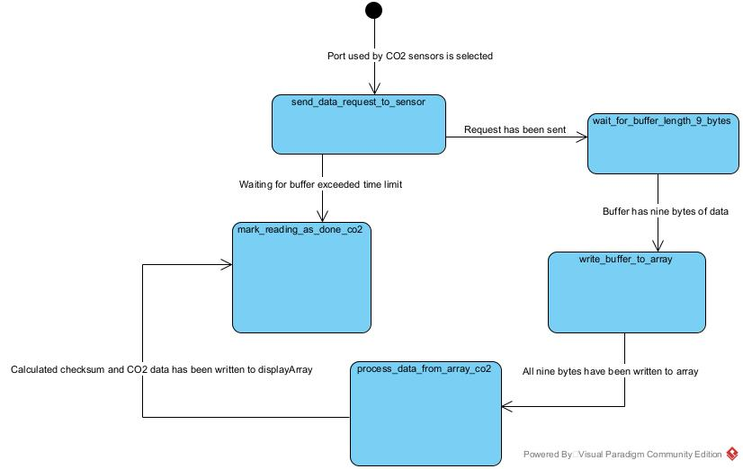
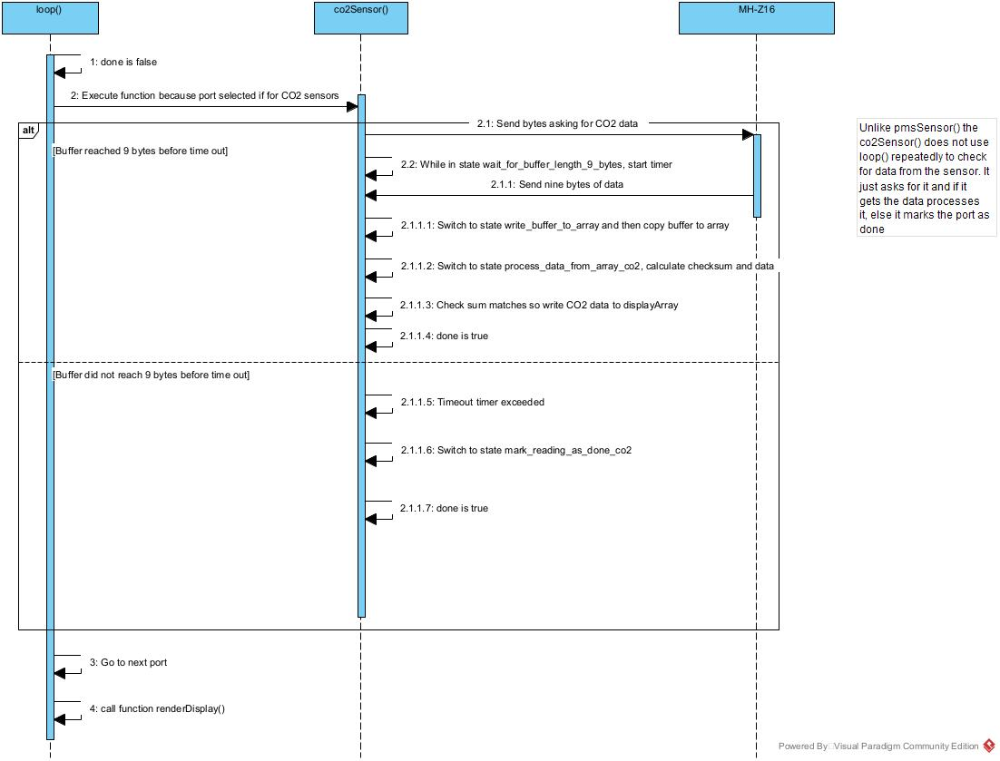

# AIT interlab internship
## Test sensor project
PMS7003 sensor state diagram

PMS7003 sensor sequence diagram

MH-Z16 sensor state diagram

MH-Z16 sensor sequence diagram

### How the testSensors program works
The program repeatedly uses loop to process each state when getting data from a port used by the PMS7003 sensor. On the other hand, for the MH-Z16 sensor it is straightforward. If it gets data it will store it and process it, else it just marks it as connection failed.