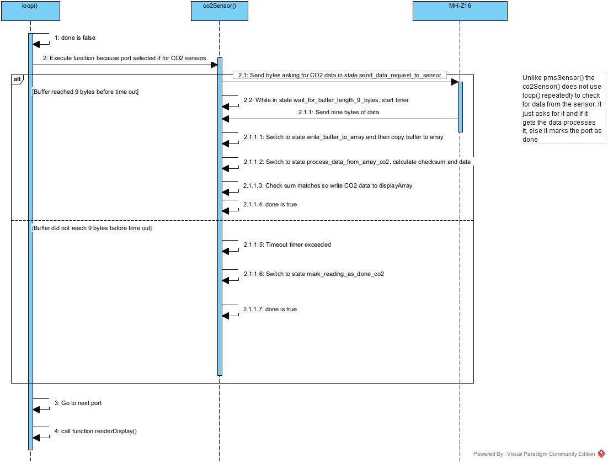

# AIT Interlab internship
## Testing sensors
The testSensors .ino file in the folder testSensors is a program that can test sensors. It tests MH-Z16 and PMS7003 sensors. How it works is it has organized each port as having a specific sensor assigned to it and when it gets to that port it executes the appropriate function for it to read data from it and return the data it got from it. The functions work by state machines to get data from the sensors. Once it reaches the end of iterating through all ports it goes back to the beginning. The program asks at the very beginning if the user would like to modify specific MH-Z16 sensors by turning on or off self calibration for those sensors at the ports assigned to them, and it allows the user to modify each individual one. If the user doesn't want to change anything they can just wait ten seconds for the time out to let them skip this prompt and get to reading. The program can be told to not read from specific ports by the use of switches. If the program couldn't get data either because the sensor took too long to respond or is disconected from the port the program will return the number -1, and if the program got data from a sensor but its checksum did not match it will return the number -2. This is shown also on the display as CF for -1, CF standing for Connection Failed, and CCF for -2, CCF standing for Check COde Failed. Below are diagrams to help understand how the program works to read data from specific sensors. First two are about PMS7003 sensors and the next two are about MH-Z16 sensors. There is also the python data logger program called save_sensor_data found in the testSensors folder and the android data logger app called BLEDProject found in the androidApp folder. The python data logger must be run before running the actual arduino program so that it can detect the text responses of the user and only record the actual data. The android app gets data from the ESP32 by Bluetooth Low Energy and displays the data it gots. There is a button in the app to start recording and end recording. After ending recording a csv file will be created in the following file path Android>data>com.example.bledproject inside is the folder files, which inside it are csv logs of the data recoded between pressing the start recording and stop recording button. The python data logger program records timestamps. The android app also records timestamps.
# State diagram of pmsSensor function

# Sequence diagram of pmsSensor function

# State diagram of co2Sensor function

# Sequence diagram of co2Sensor function

